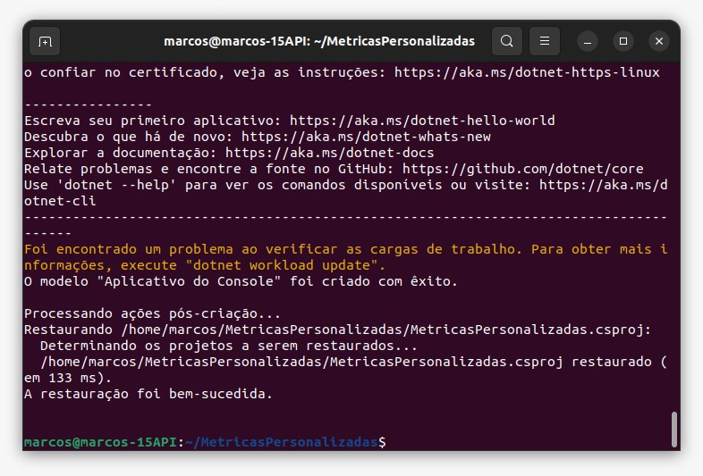
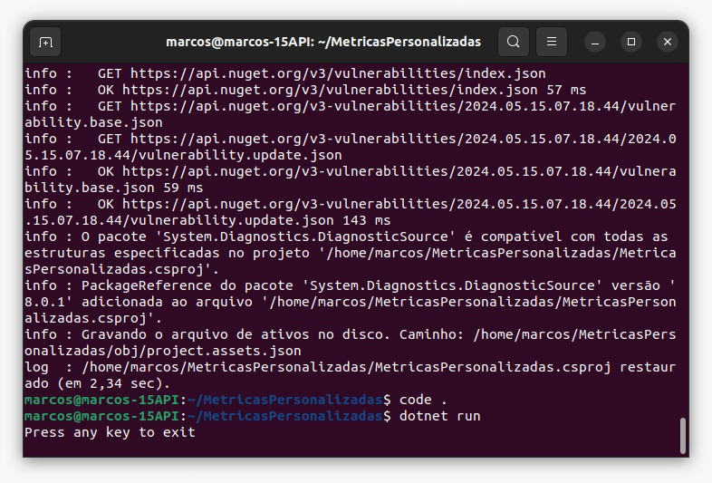
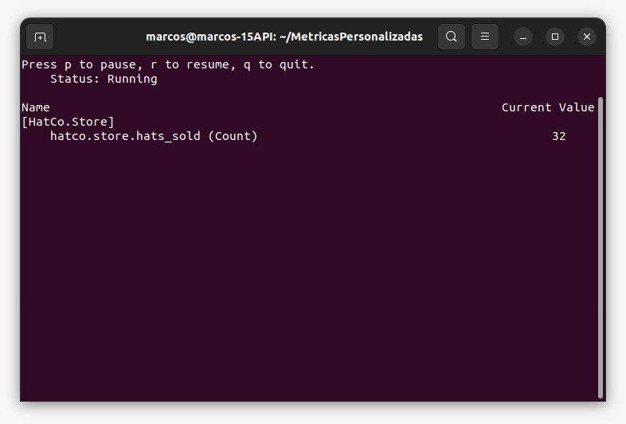
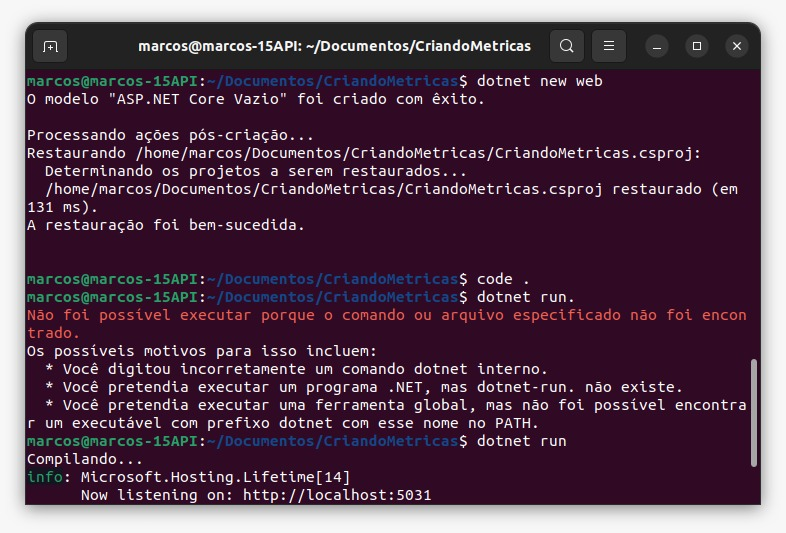
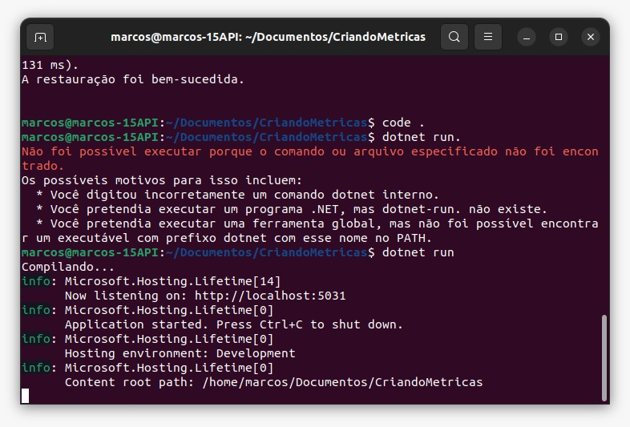
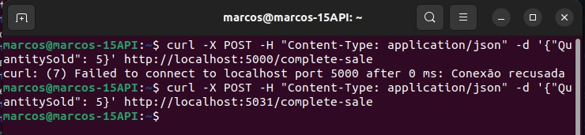
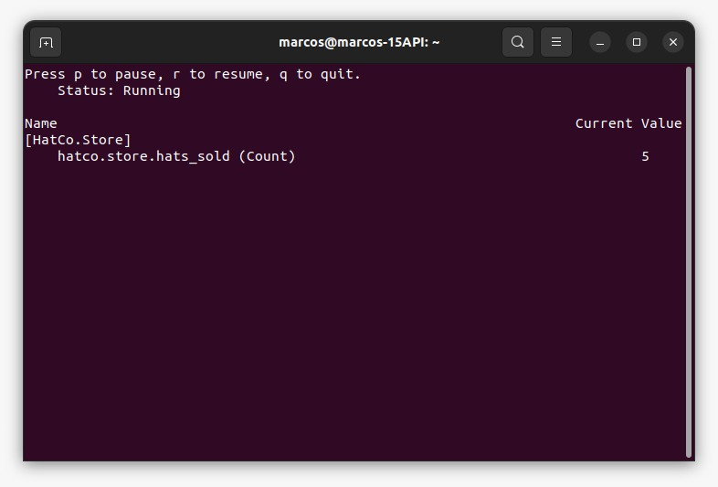

# Criando métricas

## Implementação de Métricas Personalizadas

### Passo 1: Configuração do Ambiente
Para iniciar, configuramos o ambiente de desenvolvimento com o SDK do .NET Core 8, garantindo compatibilidade com as APIs de métricas utilizadas.

### Passo 2: Criação de Métricas Personalizadas
1. Criei um novo aplicativo de console e adicionei a referência ao pacote NuGet `System.Diagnostics.DiagnosticSource` na versão 8.
2. Utilizei a classe `Meter` do namespace `System.Diagnostics.Metrics` para criar um grupo nomeado de instrumentos.
3. Criei um contador denominado "hatco.store.hats_sold" para registrar as vendas de chapéus.
4. Durante a simulação de transações, os valores foram registrados utilizando o método `Add`.




### Passo 3: Exibição e Monitoramento de Métricas
Utilizei a ferramenta `dotnet-counters` para monitorar as métricas em tempo real. 


## Implementação da Classe HatCoMetrics
A classe `HatCoMetrics` foi criada para gerenciar e registrar métricas relacionadas às vendas de chapéus na loja HatCo.

### Passo 1: Definição da Classe
```csharp
using System.Diagnostics.Metrics;

public class HatCoMetrics
{
    private readonly Counter<int> _hatsSold;

    public HatCoMetrics(IMeterFactory meterFactory)
    {
        var meter = meterFactory.Create("HatCo.Store");
        _hatsSold = meter.CreateCounter<int>("hatco.store.hats_sold");
    }

    public void HatsSold(int quantity)
    {
        _hatsSold.Add(quantity);
    }
}
```

## Configuração da Injeção de Dependência

###   A classe HatCoMetrics foi configurada para ser injetada usando o ASP.NET Core, permitindo seu uso em toda a aplicação.

```csharp
var builder = WebApplication.CreateBuilder(args);
var app = builder.Build();

// Registro da classe HatCoMetrics com o contêiner de DI
app.Services.AddSingleton<HatCoMetrics>();

// Configuração do endpoint para a rota '/complete-sale'
app.MapPost("/complete-sale", ([FromBody] SaleModel model, HatCoMetrics metrics) =>
{
    // Lógica de negócio, como salvar a venda em um banco de dados

    metrics.HatsSold(model.QuantitySold);
});

app.Run();
```
## Verificação da API
Após a implementação das métricas personalizadas e sua integração na aplicação ASP.NET Core, é crucial verificar se a API está funcionando corretamente e se as métricas estão sendo registradas conforme o esperado. Para realizar essa verificação, podemos seguir os seguintes passos:

### Passo 1: Execução da API
Inicie a aplicação ASP.NET Core que contém as métricas personalizadas implementadas. Certifique-se de que a aplicação esteja executando sem erros.



### Passo 2: Envio de Requisições à API
Envie uma série de requisições à API para simular diferentes cenários de uso. Por exemplo, envie requisições para criar vendas de chapéus na loja HatCo.


### Passo 3: Monitoramento das Métricas
Utilize ferramentas de monitoramento, como o `dotnet-counters`, para verificar se as métricas estão sendo registradas corretamente durante o teste da API. Analise os dados coletados para garantir que as métricas estejam refletindo com precisão o comportamento da aplicação.


### Passo 4: Análise dos Resultados
Após a conclusão do teste da API e a verificação das métricas, analise os resultados obtidos. Verifique se as métricas estão alinhadas com as expectativas e se estão fornecendo insights úteis sobre o desempenho e o comportamento da aplicação.

### Passo 5: Ajustes e Otimizações
Com base nos resultados da verificação da API e na análise das métricas, faça ajustes e otimizações na aplicação, conforme necessário. Isso pode envolver aprimoramentos no código, ajustes na configuração das métricas ou otimizações no ambiente de execução da aplicação.

A verificação da API e a análise das métricas são etapas essenciais para garantir o bom funcionamento e o desempenho adequado de uma aplicação ASP.NET Core, permitindo identificar e corrigir problemas de forma proativa.


